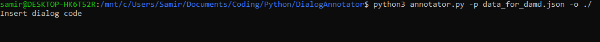
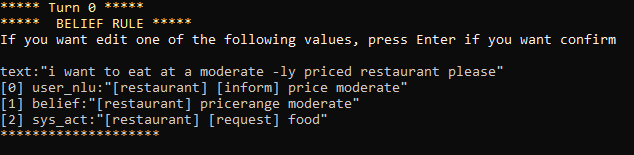
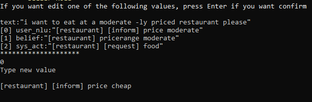
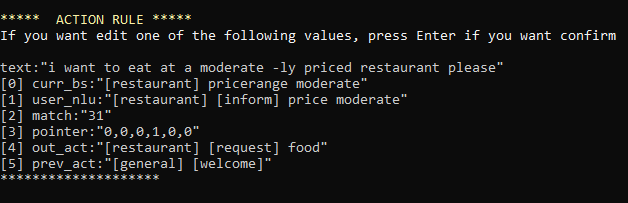
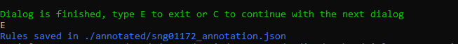

# Dialog Annotator

## Setup

To install all packages launch setup.py file, located in the root directory. Open cmd from the project root directory and launch command:
```bash setup.py ```

## Run

After installing the necessary packages you can run the Dialog Annotator. Open cmd in the project root directory and launch the following command: ```python annotator.py -p data_for_damd.json ``` or ```python3 annotator.py -p data_for_damd.json ```

## Annotated dialogs

After you finish to annotate a dialog, the dialog annotator save rules in ```/annotated/ <dialog_code>_annotation.json```

## Screenshots










